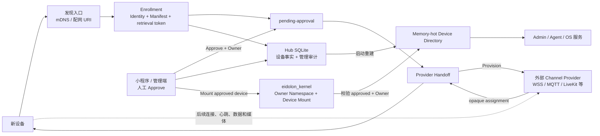
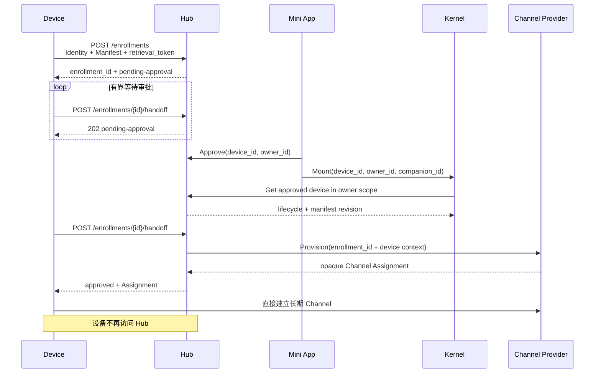
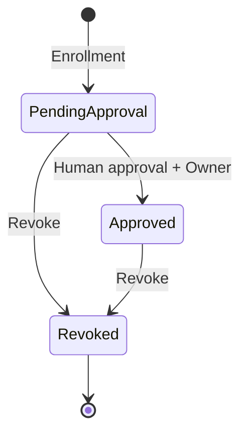

# eidolon-hub

Eidolon Hub 是 Eidolon OS 的 **Device Onboarding、Registry 与 Policy Authority**：它是新设备加入系统的入口，保存设备身份和能力，等待人工审批，并把已批准设备安全交接给外部 Channel Provider。

交接完成后，设备不再连接 Hub。Hub 不是长期设备连接服务、在线状态服务、Device Bus、Channel 或媒体服务器。



## 一分钟理解边界

| Hub 负责 | Hub 不负责 |
|---|---|
| mDNS 发布 HTTPS Onboarding Descriptor | 跨 VLAN 泛洪 mDNS、WAN transport |
| 接收 Device ID、Manifest 和短期 retrieval token | 长期 Device Session、Heartbeat、Lease |
| `pending-approval / approved / revoked` 策略 | 设备 `online`、Channel presence |
| Owner、人工审批和终态吊销 | Command、State、Event、Audio、Video |
| Device Directory 与管理审计 | MQTT/WSS/LiveKit backend 和协议转换 |
| 向单一 Provider 发起 Provision/Revoke | 解析或持久化 `opaque_binding` |
| Device 到 Owner 的准入事实 | Device 到 Companion 的 Mount 与 OS Namespace |

当前产品形态刻意收敛为 **Local-only、单进程、Hub 独占 SQLite**，没有 Cloud、PostgreSQL、多实例、NATS、MQTT、LiveKit 或 OpenTelemetry 运行时分支。

## 最小设备流程



人工 Approval 负责授权；随机 retrieval token 只负责把审批结果交给原始 Enrollment 发起者。Hub 只保存 Token 的 SHA-256 hash，Token 不进入 Directory、Provider 请求、事件或日志。审批会重新打开一个有限 Handoff 窗口；窗口内重复请求使用稳定的 `enrollment_id` 作为 Provider operation ID，可安全重试。

小程序必须通过二维码、短码、BLE/SoftAP 或设备物理确认识别用户正在添加的真实设备。Hub 不使用自声明公钥的 Challenge/Proof 冒充这一步初始信任。

当前 Hub 尚未接收或校验该带外确认结果，因此 Approval 只能交给受信 `hub-admin`。在小程序对接前，必须先选定二维码/BLE/物理确认协议并扩展 Approval Contract；不能让普通 Owner 仅凭设备自声明 ID 认领设备。

## 设备状态



`approved` 只表示“获准进入 Eidolon OS”，不表示设备在线。设备在线、Channel 续约、重连和 Provider credential 生命周期全部由 Channel Provider 管理。

## 与 eidolon_kernel 的边界

Owner 是 Eidolon OS 的根安全与命名空间主体，`owner_id` 是稳定、不透明的 principal ID；它不是账号资料、Persona 或 Companion。Hub 只拥有“这个设备是否获准进入该 Owner 的设备域”这一准入事实，不拥有 Owner profile，也不决定设备 Mount 到哪个 Companion。

`eidolon_kernel` 拥有 Device Mount 与 OS Namespace。管理端/小程序依次编排 Approval 和 Mount；Kernel 通过 Hub 的 Owner-scoped Device Get 校验设备为 approved 且 Owner 匹配。Hub 不导入 Kernel package、不调用 Kernel，也不保存 `companion_id`，从而避免 Hub↔Kernel 循环依赖和双重 Mount 权威。Approved 但尚未 Mount 是安全、可重试的中间状态。

当前 Kernel 已实现 Hub HTTP consumer 和跨 Owner fail-closed 的 Mount Core；真实 Companion Authority 尚未发布稳定契约，因此完整生产 Mount E2E 仍未完成。这个 blocker 不应让 Mount 或 Owner 业务语义回流 Hub。

## 代码架构

```text
hub/
├── domain/          # Device、Manifest、请求级 Channel 值对象与不变量
├── application/     # Enroll/Handoff/Approve/Revoke、Get/List、Directory 投影
├── ports/           # Repository、retrieval token、Provider、授权和审计接口
├── contracts/       # JSON Schema、生成 shape、严格 DTO、Mapper、golden example
├── adapters/        # SQLite、内存 Directory、Provider HTTP、mDNS、JWT、Token hash
├── interfaces/      # Device Onboarding 与 Device Management HTTP Router
├── composition/     # 唯一依赖注入、基础设施选择和生命周期组装点
├── config.py        # 严格 Local-only Settings Model
└── main.py          # ASGI 稳定入口
```

真实 import 方向如下（`A -> B` 表示 A 可以导入 B）：

```text
domain
ports       -> domain
application -> ports + domain
contracts   -> ports + domain
adapters    -> contracts + ports + domain
interfaces  -> contracts + application + ports + domain
composition -> interfaces + adapters + contracts + application + ports
main        -> composition
```

Domain/Application 不导入 FastAPI、SQLAlchemy、HTTPX、Zeroconf 或具体 Provider；Router 只调用 Application；SQLAlchemy 只存在于 Persistence Adapter 和 Composition 边界。逐目录与逐文件说明见 [代码架构与完整代码导览](docs/code-architecture.md)。

## 对外契约

### Device Onboarding

| API | 作用 |
|---|---|
| `GET /api/device-onboarding/v1/descriptor` | 公布 Hub ID、协议版本和 Enrollment URI |
| `POST /api/device-onboarding/v1/enrollments` | 创建或幂等重试短期 Enrollment |
| `POST /api/device-onboarding/v1/enrollments/{enrollment_id}/handoff` | 等待审批；Approved 后获取 Provider Assignment |

### Device Management

| API | 作用 |
|---|---|
| `GET /api/device-management/v1/owners/{owner_scope}/devices/{device_id}` | 按稳定 ID 获取设备元数据 |
| `GET /api/device-management/v1/owners/{owner_scope}/devices` | 结构化过滤、搜索与 cursor 分页 |
| `GET /api/device-management/v1/owners/{owner_scope}/events` | 按 stream position 增量读取管理事件 |
| `POST /api/device-management/v1/devices/{device_id}/approval` | 人工审批并绑定 Owner |
| `POST /api/device-management/v1/devices/{device_id}/revocation` | 终态吊销并通知 Provider |

Kernel 只消费现有精确读取：`GET /api/device-management/v1/owners/{owner_scope}/devices/{device_id}`。Hub 不为 Kernel 新建第二套设备 DTO 或数据库访问通道。

### Channel Provider Control

Hub 固定调用：

- `POST {contract_url}/device-channels/provision`
- `POST {contract_url}/device-channels/revoke`

Hub 只验证 Assignment 通用 Envelope 并原样转交 opaque binding。MQTT、WSS、LiveKit 等是 Provider backend。当前控制调用低频且 payload 小，没有真实证据支持增加 gRPC 工具链。

FastAPI 同时发布 `/openapi.json` 和 `/docs`。JSON Schema 是正式 Wire Contract 源，位于 [`hub/contracts/schemas`](hub/contracts/schemas)；生成模型禁止手工编辑。

## 存储与内存热路径

默认数据库为 `/Users/manson/eidolon/data/eidolon-hub.sqlite3`，只包含：

| 表 | 作用 |
|---|---|
| `hub_devices` | Enrollment、Token hash/窗口、Identity、Manifest、Owner 与生命周期权威事实 |
| `hub_events` | 有序、Owner-scoped 的低频设备管理审计；管理操作保存经 JWT 验证的 `sub` |

公共 Device Directory 是 `hub_devices` 的安全内存投影：启动时从 SQLite 重建，Get/List 走内存。Device Mutation 使用一个 SQLite Unit of Work，在同一事务提交设备事实、请求幂等标记和管理审计，再更新投影；幂等重试会从权威事实修复投影。没有重复的 Directory 表，也没有 Session、Challenge、Channel 或 Command 表。

Owner 与操作审计主体是两个不同维度：`owner_id` 表示设备归属的 OS 根命名空间；`principal_id` 表示这次管理操作由哪个已认证 JWT `sub` 执行。请求体不能伪造后者。设备自行发起的 Enrollment 只记录显式的 `untrusted-device:{device_id}`，不把它提升为可信 Owner 身份。

SQLite 使用 WAL，进程持有 `<database>.lock` 独占锁。空库按当前 ORM 建表；旧结构直接拒绝，不提供 migration、兼容、多实例或网络文件系统支持。

## 配置与运行

[`config/settings.yaml`](config/settings.yaml) 只包含：

- `onboarding`：Hub ID、设备真正可访问的 TLS 基址、短期 retrieval/handoff 窗口；
- `discovery.mdns`：是否发布同链路 Descriptor；
- `channel_provider.contract_url`：唯一 Provider 控制地址；
- `persistence.path`：Hub 独占 SQLite 路径。

`.env` 只保存两个 Secret：

- `EIDOLON_HUB_MANAGEMENT_JWT_SECRET`
- `EIDOLON_HUB_CHANNEL_PROVIDER_TOKEN`

```bash
uv sync --all-groups
cp config/.env.example config/.env
# 填入两个至少 32 bytes 的 Secret
uv run uvicorn hub.main:app --host 0.0.0.0 --port 8082
```

ASGI 监听、TLS、可信代理和 Nginx/Ingress 属于部署层。`onboarding.public_base_url` 必须是设备真正可访问的 HTTPS 地址。默认读取 `config/settings.yaml`；可通过 `EIDOLON_HUB_SETTINGS_YAML=/absolute/path/settings.yaml` 覆盖。

## 验证与文档

```bash
uv run python scripts/generate_contracts.py --check
uv run lint-imports
uv run ruff check hub tests scripts
uv run pytest -q
```

从 [文档导航](docs/README.md) 开始阅读；实现归属以 [架构标尺](docs/architecture/device-control-subsystem.md) 为准，测试边界见 [测试策略](docs/testing/test-strategy.md) 和 [测试报告索引](docs/testing/reports/README.md)。

## License

MIT
