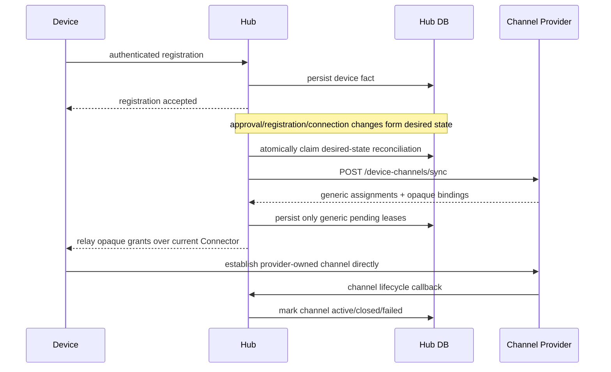

# ADR 0010: Channel Provider 是 Hub 之外的通道策略与资源所有者

- 状态：Superseded by ADR 0011、0013、0017
- 日期：2026-08-01
- 基线提交：`37f38cdc69c7f4a37000fc9b18fef48601203857`

## 背景

> 本文保留上一阶段的异步 desired-state 方案作为决策历史；当前实现见 ADR 0017，不再包含 reconciler、SQL claim、mailbox、MQTT Connector、Channel metadata 持久化或 Lifecycle callback。

旧实现由 Hub 配置 Channel Profile、Profile 到 Provisioner 的映射以及管理通道名称，随后同步调用 Provider 的 provision/renew/revoke 操作。这个模型同时承担了三件不同的事：

1. Hub 决定设备应使用哪一种通道组合；
2. Provider 创建 WSS、LiveKit 或其他通信资源；
3. Hub 根据设备信令推断通道是否已经建立。

这使 Hub 获得了不属于设备总线的部署策略，也使 Provider 故障可能反向影响设备注册。Profile 名称还泄漏到了命令发送、数据库索引和公共管理 API，导致控制层与实际传输层无法独立演进。

## 决策

Hub 只配置一个 Channel Provider 契约基址。固定契约路径、认证环境变量和 Wire Schema 属于代码契约，不作为可变业务配置：

```yaml
channel_provider:
  contract_url: http://127.0.0.1:8090/v1
```

Hub 在设备事实已经持久化之后，以异步、幂等方式向 Provider 同步最小设备上下文，包括 identity fingerprint、tenant/owner 安全归属、Manifest、审批/撤销和当前可达性。Provider 独立决定创建 WSS、LiveKit、TURN 或其他通道，并返回一个或多个通用 Channel Assignment。Hub 只验证 Assignment 的通用元数据，将 `opaque_binding` 原样转交设备，不解析、不持久化、不记录。



实现分为四层：

- Contract：JSON Schema、运行时 Wire DTO、固定 HTTP 路径。
- Domain：Provider-neutral 的 device context、assignment、lease 和 lifecycle 状态机。
- Application：desired-state reconciler 与 lifecycle use case。
- Adapter：HTTP Provider client、HTTPS/MQTT grant relay、SQL persistence、DataEnvelope transport。

Provider Control 与 Data Transport 是两个独立 Port。它们可以由同一部署提供，但 Core 不假设其协议实现相同。

## 不变量

- 未审批、已撤销且从未同步的设备不会获得通道。
- Provider 不在注册事务或注册请求关键路径中；Provider 故障不回滚设备事实。
- 设备事实产生稳定的 desired revision；同一次失败重试和仍可用 pending Grant 的补投使用同一个 `operation_id`，Provider 必须幂等。
- 终态或进入 30 秒刷新窗口的 Assignment 使用由 desired revision 与当前 lease generation 确定的新 `operation_id`。Provider 必须返回覆盖刷新窗口的新租约，避免把已过期的幂等响应永久重放。
- 多 Hub 实例通过数据库 claim/lease 竞争同一个同步意图，不依赖 NATS。
- Grant 初始为 `pending`；只有 Provider lifecycle 的 `active` 状态可承载命令和设备数据。
- 活跃、已审批设备的 Provider 响应必须绑定正确的 operation、device 和 manifest revision。
- Owner transfer 属于安全事实，必须改变 desired revision 并同步给 Provider；它不是 Hub 的通道选择规则。
- Hub 只访问配置的契约基址和固定相对路径，拒绝 Provider 响应中的任意回调 URL。
- Bearer-authenticated Provider egress 不继承环境代理；只有 loopback 可用 HTTP，远端契约必须 HTTPS。
- `opaque_binding` 不进入数据库、日志、管理 API 或事件账本。
- 设备断开最后一个 Connection、撤销或失去审批后，以 desired-state sync 通知 Provider 关闭资源。

## 失败与一致性

设备、审批和连接是数据库权威事实。Channel 同步是可重建的派生状态：后台 Reconciler 扫描事实、计算 desired revision、获取有期限的数据库 claim，失败后记录有限错误信息并重试。Hub 重启不丢失同步需求。

Provider 返回 Binding 后如果设备信令失败，Hub 删除未交付的 pending lease 并保持同步为 failed；下一次以同一个 operation 重试，由 Provider 重发同一幂等响应。Hub 不保存密钥材料来“补发”。已经投递但未收到 lifecycle 的 pending Grant 在仍可用时按相同 operation 重投；进入刷新窗口或收到终态 lifecycle 后才轮换 operation generation。

SQL claim 只提供进行中操作的多实例互斥，不判断业务是否收敛。是否需要补投、刷新或关闭由 Application 根据设备事实和通用 lease 状态决定；Persistence Adapter 不包含 Channel 策略。

## 被删除的设计

- Hub-owned Channel Profile 与 Profile selection。
- 多 Provider endpoint map 与 provisioner reference。
- Hub 的 provision/renew/revoke Provider 生命周期编排。
- 公共 `POST /devices/{id}/channels/{profile}`。
- 设备通过 HTTPS/MQTT 上报 channel offer/accept/close。
- 通过 Profile 名称选择管理 Data Channel。

## 影响

Provider 契约成为独立版本化边界，Provider 内部可以聚合多个实际通道服务。Hub 保留必要的设备授权、lease、幂等、生命周期和 DataEnvelope 安全验证，不再承担媒体/传输策略。
