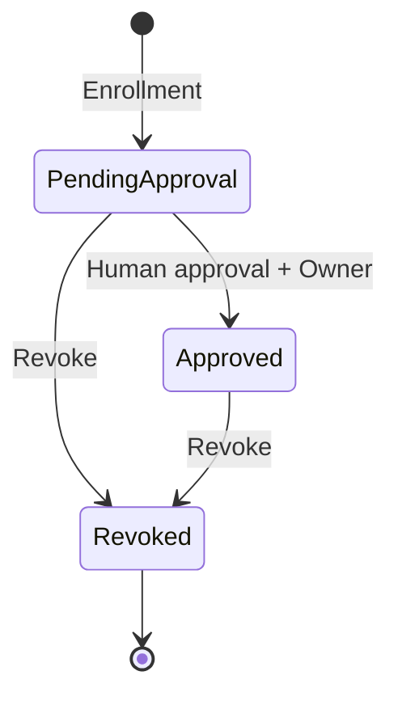

# Eidolon Hub 架构标尺：Device Onboarding Subsystem

- 状态：Normative
- 适用范围：`eidolon_hub` 的代码、配置、数据库、Wire Contract 与测试
- 最后更新：2026-08-04

## 1. 角色定位

`eidolon_hub` 是 Eidolon OS 的 **Device Onboarding、Registry 与 Policy Authority**。它负责让一个尚未加入系统的设备被识别、等待人工批准、绑定 Owner，并安全取得外部 Channel Provider 的连接信息。

Owner 是 OS 根安全/命名空间 principal。Hub 将设备准入到一个 Owner scope，但不拥有 Owner profile、账号资料或 Companion，也不拥有该 Owner scope 内部的 Device Mount。

Provider 交接成功后，设备不再依赖 Hub。Hub 不是长期连接管理器、在线状态服务、Device Bus、Channel Gateway、命令服务或媒体服务。

Hub 只拥有四类事实：

1. Device Registry：稳定 Device ID、显示信息和能力 Manifest。
2. Device Policy：`pending-approval / approved / revoked`、Owner 和管理幂等事实。
3. Device Onboarding：有界 Enrollment、retrieval token hash 和 Provider Handoff。
4. Device Directory：向 OS 提供不泄密的设备 metadata 查询与管理审计。

## 2. 判断代码归属的标尺

一段逻辑只有在回答下列问题之一时才应进入 Hub：

- 新设备声明了什么稳定身份和能力？
- 用户是否批准该设备加入，设备归属哪个 Owner，是否已被吊销？
- 如何把批准结果和 Provider Assignment 交给发起该 Enrollment 的设备？
- Eidolon OS 如何按 Owner、稳定 ID 或结构化条件查询设备 metadata？
- 谁在何时改变了设备管理事实？

以下问题不属于 Hub：

- 设备是否在线、如何心跳、续租和重连；
- MQTT Topic、WSS、LiveKit Room、TURN、Codec 或媒体如何组织；
- Command、State、Event、Audio、Video 如何传输或重试；
- Channel credential 如何签发、更新和撤销。
- 设备 Mount 到哪个 Companion、如何解析 OS Namespace 和跨服务安全上下文。

长期通信属于 Channel Provider；Device Mount、Owner Namespace 与跨服务权威状态属于 `eidolon_kernel`。

## 3. 最小生命周期

- `pending-approval`：Hub 已保存设备声明，尚未授权进入 OS。
- `approved`：已人工批准并绑定 Owner，可以请求 Provider Handoff。
- `revoked`：终态吊销；当前 Enrollment 和后续 Provider 使用资格失效。

`approved` 不是 `online`。Hub 不维护 Session、Heartbeat、Lease、presence 或 Channel lifecycle，也不把发现、连接和业务可用性混进设备状态机。

## 4. Device Onboarding Contract

设备只使用三个低频 HTTPS 操作：

| 操作 | 目的 |
|---|---|
| `GET /api/device-onboarding/v1/descriptor` | 获取 Hub ID、版本和 Enrollment URI |
| `POST /api/device-onboarding/v1/enrollments` | 提交 Device ID、Manifest 和高熵 retrieval token |
| `POST /api/device-onboarding/v1/enrollments/{id}/handoff` | 在有界窗口内查询审批结果；批准后取得 Provider Assignment |

Enrollment 创建方必须生成至少 32 字符的随机 retrieval token。Hub 只保存 SHA-256 hash；明文 Token 不进入日志、事件、Directory 或 Provider 请求。人工审批成功后，Hub 重新打开一个有限 Handoff 窗口。重复 Handoff 使用稳定 `enrollment_id` 作为 Provider operation ID，Provider 必须幂等。

retrieval token 只证明调用方持有 Enrollment 时的随机秘密，不证明设备物理真实性。小程序必须通过二维码、短码、BLE/SoftAP 或设备物理确认，把用户正在操作的真实设备与 `enrollment_id` 进行带外绑定。人工 Approval 才是授权边界。

当前代码尚未接收该带外确认结果，所以只有受信 `hub-admin` 可以 Approval。普通 Owner 的认领协议必须在小程序 pairing 方案确定后进入独立 Wire Contract；禁止临时放开“按自声明 Device ID 认领”。

## 5. Management 与 Provider Contract

小程序、Admin 和 OS metadata consumer 使用版本化 HTTP/JSON：

- `GET /owners/{owner_scope}/devices/{device_id}`：稳定 ID 精确读取；
- `GET /owners/{owner_scope}/devices`：结构化过滤、搜索和 cursor 分页；
- `GET /owners/{owner_scope}/events`：按 stream position 增量读取管理审计；
- `POST /devices/{device_id}/approval`：人工批准并绑定 Owner；
- `POST /devices/{device_id}/revocation`：终态吊销并通知 Provider。

Get/List 是 metadata 控制面，不是数据热路径。当前没有证据支持引入 gRPC；HTTP/JSON 同时适合小程序、浏览器和服务端，并由 OpenAPI/JSON Schema 直接描述。

Hub 只向一个配置的 Provider 调用：

- `POST {contract_url}/device-channels/provision`
- `POST {contract_url}/device-channels/revoke`

Provider 根据设备事实和自身配置决定 MQTT、WSS、LiveKit 或其他 backend，并返回通用 Assignment Envelope 与 `opaque_binding`。Hub 不理解、不持久化、不记录 binding 内容，只在当前 Handoff 调用栈中原样转交。

## 6. Kernel Contract 边界

管理端/小程序负责编排两个独立、可重试的动作：

1. 向 Hub Approval，将设备准入指定 Owner。
2. 向 Kernel Mount，将 approved Device 挂入同一 Owner Namespace 下的 Companion。

Kernel 只消费 Hub 已有的 Owner-scoped 精确 Device Get，验证稳定 Device ID、`approved` 和 Owner 匹配。Hub 不新增 Kernel 专用设备副本、不保存 `companion_id`、不导入或调用 Kernel。Approved 但 Unmounted 是安全中间态；Mount 失败不得回滚 Hub Approval。

Kernel 把 `owner_id` 当作稳定、不透明的根 principal，只拥有 Namespace/Security Context 语义，不拥有用户资料。当前真实 Companion Authority 契约尚未稳定，Kernel 生产 Mount fail closed；该 blocker 不改变 Hub 边界。

Hub 管理审计仍需记录实际执行者，但它不形成第二套 Owner。Approval/Revocation 的 `principal_id` 由 Management Authorizer 从已验证 JWT `sub` 取得，回答“谁执行”；`owner_id` 回答“设备属于哪个 OS namespace”。两者都进入原子 Device Mutation，且前者不能由管理请求体指定。Kernel V1 的 trusted-local 调用代表单一 Owner context，不要求把 Hub 的远端管理 Principal 复制进 Mount Domain。

## 7. 存储模型

Local-only Hub 使用独占 SQLite `/Users/manson/eidolon/data/eidolon-hub.sqlite3`：

| 表 | 权威内容 |
|---|---|
| `hub_devices` | Enrollment、Token hash/窗口、Identity、Manifest、Owner、生命周期和幂等字段 |
| `hub_events` | 有序、Owner-scoped 的低频管理审计 |

Device Directory 是 `hub_devices` 的进程内安全投影。启动时直接从设备事实重建，Get/List 走内存。Device Mutation 在一个 SQLite 事务内同时提交设备事实、请求幂等标记和管理审计，然后更新投影；幂等重试重新执行 Projector 以修复提交后的投影失败。数据库中不复制 Directory 表，也没有 Session、Challenge、Command、Channel 或 opaque binding 表。

当前 ORM 是唯一 Schema。空库直接建表，旧或部分结构直接拒绝；开发阶段不提供 migration、兼容或转换脚本。SQLite 使用 WAL 和进程文件锁，仅支持本机单进程独占访问。

## 8. 必须长期成立的不变量

1. Device ID 不依赖 IP、mDNS instance、MQTT client ID、LiveKit room 或 Channel ID。
2. 设备不能自授 Owner、审批状态或 Channel credential。
3. Approved 设备必须有 Owner；revoked 是终态。
4. Handoff 必须同时满足正确 retrieval token、未过期窗口和 approved 策略。
5. 公共 Directory 不暴露 Token hash、Enrollment 窗口、Provider 地址或 opaque binding。
6. Router 只调用 Application Use Case/Query，不直接操作 SQLAlchemy。
7. Domain/Application 不出现 FastAPI、SQLite、MQTT、LiveKit、NATS 或 Provider backend 判断。
8. 所有集合查询有上限和稳定 cursor；所有变更操作可幂等重试。
9. Device Fact、Mutation 幂等标记和 Management Audit 必须原子提交；失败时不得只更新设备或内存。
10. Provider 交接后的连接、在线、数据和媒体职责不得回流 Hub。
11. Hub 只拥有 Device→Owner 准入；Device→Companion Mount 与 Owner Namespace 只有 Kernel 一个权威。
12. Hub 管理操作的审计 `principal_id` 只能来自认证边界；它与 Owner namespace 正交，不得成为第二个目标 Owner 参数。
12. 新需求若越过本标尺，必须先更新 ADR 和本文，再修改代码。
