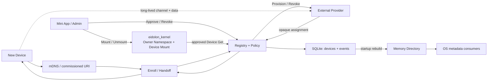

# Eidolon Hub 当前完整架构 Review

- 状态：Local-only 实现基线
- 日期：2026-08-05
- 证据范围：当前 `eidolon_hub` 源码、配置、Schema 和自动化测试

## 1. 结论

Hub 已从长期 Device Manager 进一步收敛为 **Device Onboarding、Registry 与 Policy Authority**。它保存设备 metadata 和管理事实，完成人工审批，并把已批准设备交给外部 Channel Provider。交接后不再管理设备连接、在线或业务数据。

当前运行形态：

- Local-only、单进程、Hub 独占 SQLite；
- mDNS 只发布同链路 HTTPS Onboarding 入口，复杂网络以配网保存 URI 为可靠基线；
- 生命周期只有 `pending-approval / approved / revoked`；
- Device Directory 是 SQLite 设备事实重建出的内存热投影；
- Hub 只配置一个 Channel Provider 契约地址；
- 不包含 Session、Heartbeat、Lease、online、Command、Data Bridge 或 Channel lifecycle；
- 不依赖 NATS、MQTT、LiveKit、`eidolon_channel`、`eidolon_data`、`eidolon_sdk`、PostgreSQL 或 OpenTelemetry。

## 2. 真实运行时

Device Enrollment 未经过长期认证会话。设备提交高熵 retrieval token，Hub 只保存 hash；小程序必须用二维码、短码、BLE/SoftAP 或物理确认识别真实设备。人工批准并绑定 Owner 是授权边界。批准后 Handoff 窗口有限，Provider 调用以 enrollment ID 幂等。

## 3. 分层与代码边界

| 目录 | 当前职责 |
|---|---|
| `hub/domain` | Device、Manifest、Provider-neutral Assignment 不变量 |
| `hub/application` | Enroll/Handoff/Approve/Revoke、Provision、Get/List、Directory 投影 |
| `hub/ports` | Device 只读 Repository、原子 Mutation、Directory、Token、Provider、授权、管理事件接口 |
| `hub/contracts` | 13 个 JSON Schema、生成 shape、严格 Binding 与 Mapper |
| `hub/adapters` | SQLite、内存 Directory、Provider HTTP、Zeroconf、JWT、Token hash、Clock/ID/锁 |
| `hub/interfaces` | Device Onboarding 与 Device Management HTTP Router |
| `hub/composition` | 唯一依赖注入与资源生命周期入口 |

Domain/Application 不导入 FastAPI、SQLAlchemy、HTTPX 或 Zeroconf；Router 不取得数据库；SQLAlchemy 只存在于 Persistence Adapter 与 Composition 边界；opaque binding 只存在于 Handoff 调用栈。

## 4. ORM 与热读路径

默认数据库 `$EIDOLON_STATE_ROOT/hub/eidolon-hub.sqlite3` 只有：

| 表 | 作用 |
|---|---|
| `hub_devices` | Enrollment、Token hash/窗口、Identity、Manifest、Owner、生命周期与幂等事实 |
| `hub_events` | 有序管理审计 |

启动时从 `hub_devices` 直接生成内存 Directory，Get/List 不访问 SQLite。Device、request 幂等标记和 Management Audit 在一个 Unit of Work 事务内提交，再更新投影；幂等重试可修复提交后的投影失败。没有非原子 Device upsert/Event publish 入口或重复 Directory 表；授权与 Handoff 始终读取权威 Device Repository，不信任公共投影。

Approval/Revocation 的审计 `principal_id` 来自 JWT Authorizer 验证后的 `sub`，并参与幂等 fingerprint；请求体不能自报操作主体。它和设备归属的 `owner_id` 是正交维度，不会制造第二套 Owner namespace。

ORM 是唯一 Schema，空库直接建表；旧结构 fail-fast，无 migration 或兼容。SQLite WAL 与 `<database>.lock` 限定单机单进程。

## 5. 配置与接口

`settings.yaml` 只有 `persistence`、`discovery.mdns`、`onboarding` 和 `channel_provider`。`.env` 保存 Management JWT Secret、Kernel 精确读取 Token 与 Provider Bearer Token。ASGI host/port、TLS、代理和 Nginx/Ingress 属于部署层。

Device API：

- `/api/device-onboarding/v1/descriptor`
- `/api/device-onboarding/v1/enrollments`
- `/api/device-onboarding/v1/enrollments/{enrollment_id}/handoff`

Management API：Owner-scoped Device Get/List、Event cursor、Approval 与 Revocation。Provider 固定控制路径为 `/device-channels/provision` 和 `/device-channels/revoke`。

## 6. 已有与尚缺证据

当前 Hub 全量自动化回归为 `130 passed`，并包含真实工作区 Hub→Kernel Approval/Get/Revocation/Reconcile 联合测试。Kernel 自身全量 `82 passed`，Data 自身全量 `55 passed`；各自事实仍由各自仓库拥有。

它不证明以下外部事实：

- 当前 Approval API 尚未校验小程序的二维码/BLE/物理确认结果；在协议选定前，只能由受信 `hub-admin` 执行批准，这是生产配网安全门槛；
- 真实小程序的带外设备确认体验；
- 真实设备固件 conformance；
- `eidolon_channel`、`eidolon_admin`、`eidolon_agent` 已对接；
- 真实小程序/管理 ingress 尚未编排 Approval→Mount，真实设备与 `eidolon_channel` 仍未迁移；
- 生产 TLS/DNS/VLAN、多接口 mDNS 和网络故障恢复；
- Provider Revoke 的 credential 最终失效窗口。

Owner 在 OS 中收敛为 Kernel 根 Security/Namespace principal；Hub 只拥有 Device→Owner Admission，Kernel 只拥有同一 Owner scope 内 Device→Companion Mount，两个项目都不复制 Owner profile。Companion Identity 由 Data 的窄 Authority 契约提供。下一阶段不应向 Hub 加回 Session、Mount 或 data plane，而应完成真实小程序 pairing/编排与 `eidolon_channel` Provider 对接。
