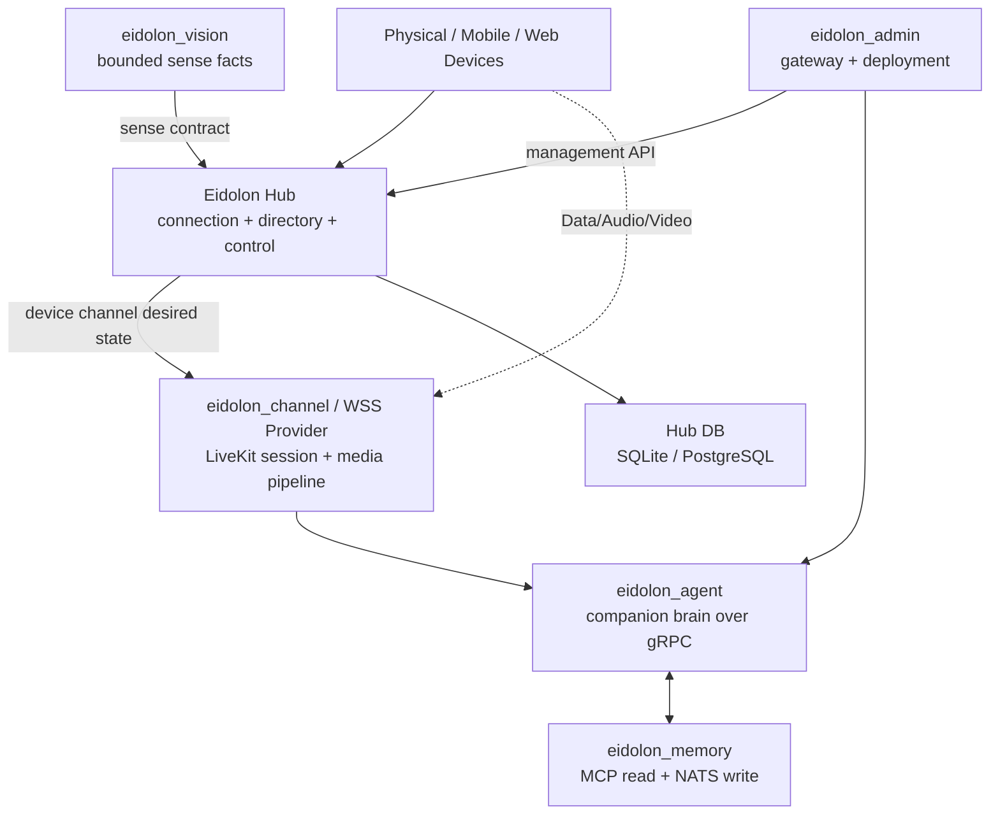

# Eidolon OS 项目边界与 Hub 集成

本页依据 2026-08-01 各兄弟项目现有 README、`pyproject.toml` 和 Admin service registry 记录目标边界；它不是对尚未修改兄弟仓库的臆测。

## 整体目标

Eidolon OS 是长期陪伴设备系统：多种终端提供身体、声音和感知，Channel 处理实时会话，Agent 提供快速应答与人格，Memory 提供长期记忆，Data 保存 owner/companion/device 等主权事实，Admin 负责部署和运维。Hub 位于这些模块之间，但只做设备控制面。

## 当前项目事实与目标契约

| 项目 | 当前事实 | Hub 重构后的正确关系 |
|---|---|---|
| `eidolon_data` | 数据主权层，拥有 owner/companion/events/storage 等现有 schema；直接依赖 SDK | 不再是 Hub 的运行时或持久化依赖。跨域数据只能以后通过显式版本化 API 同步，不能重新注入 DataStore |
| `eidolon_channel` | 独立 LiveKit voice worker，包含 Agent worker、STT/TTS/VAD/EOT，当前仍依赖 SDK/Data | 作为外部 Channel Provider：实现 desired-state sync、lifecycle callback 和 DataEnvelope 接口；继续独占设备 URL/Room/Token/TURN/Codec 与内部路由策略 |
| `eidolon_agent` | 被 LiveKit voice pipeline 通过 gRPC 调用的 Brain，不是 LiveKit client；当前使用 NATS/Memory/Data，且旧 blackboard KV 读取与新 Directory 不兼容 | 不成为 Connector。迁移为调用 Hub Device Management/API 或接收 Provider 标准控制事件，不解析 mDNS/MQTT/opaque binding；不得要求 Hub 保留 NATS |
| `eidolon_memory` | 外部长期记忆服务，MCP read、NATS write、supervisor/discovery | 不进入设备在线或 Channel 编排；Agent 是主要业务消费者 |
| `eidolon_vision` | host visual cortex，图像内存处理后只向 Hub 发 bounded `sense.*` facts；当前合同来自 SDK | 改为消费 Hub 发布的 Sense JSON Schema/generated artifact；像素永不经过 Hub |
| `eidolon_admin` | FastAPI/Vue gateway，当前把 Hub 当 `/api/admin/*` proxy，registry health 仍是旧 probe URL | 切换到 `/health` 和 `/api/device-management/v1/*`，使用 management JWT；Admin 不重建 Device/Channel domain logic |
| Mobile/Web/physical clients | 当前客户端仍使用旧 register→LiveKit token 或 mDNS-only flow | 实现统一 Hello/Proof/Register/Lease，保存 Descriptor URI，并把 opaque binding 交给对应 Provider SDK |
| `eidolon_sdk` | 其他项目的共享 contract/infrastructure；Data 当前直接依赖它 | Hub 不直接依赖。Hub-owned wire source 随 wheel 分发为 JSON Schema/AsyncAPI，不复制旧 SDK package |

## 外部 Provider 必须实现的最小接口

Provider 实现 `POST {contract_url}/device-channels/sync`，接收稳定 operation ID、Hub ID，以及最小的设备身份、Manifest revision、审批/撤销和 connected desired state。它返回零个或多个通用 Assignment 与 base64 opaque binding；不可达/撤销设备返回空集合，活跃设备至少返回可靠管理数据通道。重复 operation 必须幂等。

Hub 向 Provider 的 `POST {contract_url}/data/envelopes` 发送命令；Provider 通过 Hub 的 `/channels/lifecycle` 报告 active/closed/failed，并把设备 Ack/Result/State/Event 提交到 `/data/inbound`。音视频 track 保持 Provider 内部，不进入 Envelope 或 Hub。

Hub wheel 包含 `hub/contracts/schemas`、`bindings/asyncapi.yaml` 和 golden examples，非 Python 终端可直接生成自己的 DTO；不要通过导入 Hub Domain Entity 共享运行时对象。

## 已识别的兄弟项目迁移点

当前 Admin registry、Channel、Vision、Mobile 和 Web README 都记录了旧接口或 SDK 合同。这些仓库未在本次 Hub-only workspace 中修改，因此真实整栈切换必须作为独立、可回滚的 consumer migration：

1. 先完成 Hub Unit、Contract、Local/Cloud Functional、Deployment Mode 和独立 Contract E2E 门禁；真实基础设施缺失必须保留明确的未通过状态。
2. 再给 `eidolon_channel` 增加 HTTP Provider binding，并通过 Hub conformance suite。
3. 更新一类设备实现 URI + Connection + opaque grant；保留 Local/Cloud 独立配置。
4. 更新 Admin proxy/页面及 JWT credential issuer。
5. 将 Agent 的旧 NATS KV blackboard reader 切到 Hub Directory/API；旧 key/value 与新模型并不兼容，不能假设已有桥接。
6. 将 Vision/Sense consumer 指向 Hub 版本化 Schema。
7. 再切换 Mobile/Web/其他终端；旧 Hub runtime 已删除，不以双写或 NATS 桥接维持旧合同。

在 consumer 完成前，不能声称现有 Eidolon OS dev stack 已对新生产入口做过真实端到端验收。Hub 的 Reference Provider 黑盒 E2E 只证明 Hub 发布契约，不证明兄弟项目已经兼容。
