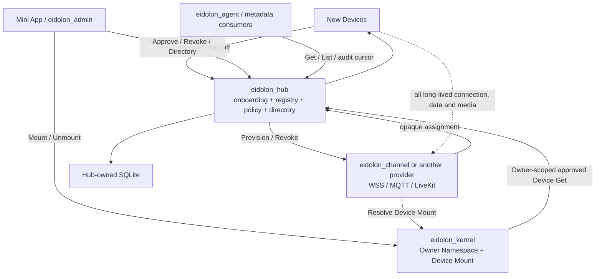

# Eidolon OS 项目边界与 Hub 集成

本页只陈述当前 Hub 代码和契约能够证明的边界。兄弟项目未在本轮修改；目标使用方不等于已经完成真实对接。

## 契约使用方

| 使用方 | 使用的 Hub 契约 | 当前证据 |
|---|---|---|
| 新设备 | Descriptor、Enrollment、Handoff；取得 opaque Assignment 后离开 Hub | Hub Functional/E2E reference client 已验证；真实设备未迁移 |
| 小程序 / Admin | Approval、Revocation、Owner-scoped Directory 与管理事件 | JWT/Router/Contract 已验证；真实小程序和 `eidolon_admin` 未做 conformance |
| Channel Provider | Hub 调用 Provision/Revoke；Provider 返回 opaque Assignment | Reference Provider Contract/Functional 已验证；`eidolon_channel` 未修改 |
| `eidolon_kernel` | 按 Owner scope 精确读取 approved Device，持有 Device→Companion Mount | Kernel Hub HTTP consumer、consumed schema 和跨 Owner测试已存在；真实 Companion Authority 阻塞完整生产 Mount |
| Agent / metadata consumer | 只读 Get/List/管理事件；设备业务 Data 由 Provider 提供 | Hub API 已存在；真实 consumer 调用未验证 |

## Channel Provider 最小要求

- `POST {contract_url}/device-channels/provision`：接收稳定 operation ID、Hub ID 和批准后的必要设备事实，按自身配置生成 Channel Assignment。
- `POST {contract_url}/device-channels/revoke`：按 operation ID 幂等吊销该设备的 Channel 与 credential。
- Provision 必须按 `operation_id=enrollment_id` 幂等，重复请求返回等价有效结果。
- Provider 完全拥有 MQTT/WSS/LiveKit backend、长期认证、连接、心跳、重连、online 和业务数据。
- Provider 不向 Hub 回调 Channel lifecycle，也不向 Hub发送 Command、State、Event 或 DataEnvelope。

Hub 不配置 channel policy，不选择 backend，不解析或持久化 `opaque_binding`。设备数据如何标准化并交给 Agent，是 Provider 与 consumer 的契约。

## Owner 与 Mount 的 OS 收敛

`owner_id` 是 Kernel Security Context 与 Namespace 的根 principal。Hub 只拥有设备获准进入哪个 Owner scope 的 Policy Fact；Kernel 只拥有该 scope 内 Device→Companion Mount。Owner profile、登录账号、Persona 和 Companion 业务资料不属于 Hub 或 Kernel Mount Core。

Hub 在自己的远端 Management Trust Boundary 内另记录经 JWT 验证的操作 `principal_id`，用于回答 Approval/Revocation 由谁执行；该值不改变 Owner scope，也不会复制到 Kernel 成为 Actor/第二 Owner。Kernel V1 只接收产品 ingress 已确定的单一 Owner context，避免 caller Owner 与 target Owner 两套可冲突输入。

Approval 与 Mount 由管理端编排，不做跨服务分布式事务。Approved/Unmounted 是安全可重试状态；Kernel 必须回读 Hub Device Authority 并对 Owner 不匹配 fail closed。Hub 不反向调用 Kernel，两个项目也不互相导入源码。

## 推荐集成顺序

1. 先保持 Hub Architecture、Unit、Contract、Component、Functional 与 E2E 门禁稳定。
2. 发布稳定 Companion Authority 契约，让 Kernel production Mount 退出 fail-closed blocker。
3. 为 `eidolon_channel` 实现 Provider Provision/Revoke 与 Kernel Mount Resolve conformance。
4. 迁移一类真实设备，验证小程序的二维码/BLE/物理确认与 Enrollment 绑定。
5. 分别为管理客户端和 metadata consumer 做契约 conformance。

旧 Device Access、Session 或数据接口不双写兼容。
