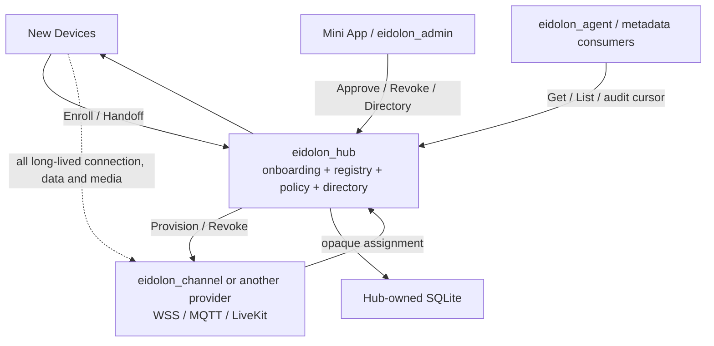

# Eidolon OS 项目边界与 Hub 集成

本页只陈述当前 Hub 代码和契约能够证明的边界。兄弟项目未在本轮修改；目标使用方不等于已经完成真实对接。

## 契约使用方

| 使用方 | 使用的 Hub 契约 | 当前证据 |
|---|---|---|
| 新设备 | Descriptor、Enrollment、Handoff；取得 opaque Assignment 后离开 Hub | Hub Functional/E2E reference client 已验证；真实设备未迁移 |
| 小程序 / Admin | Approval、Revocation、Owner-scoped Directory 与管理事件 | JWT/Router/Contract 已验证；真实小程序和 `eidolon_admin` 未做 conformance |
| Channel Provider | Hub 调用 Provision/Revoke；Provider 返回 opaque Assignment | Reference Provider Contract/Functional 已验证；`eidolon_channel` 未修改 |
| Agent / metadata consumer | 只读 Get/List/管理事件；设备业务 Data 由 Provider 提供 | Hub API 已存在；真实 consumer 调用未验证 |

## Channel Provider 最小要求

- `POST {contract_url}/device-channels/provision`：接收稳定 operation ID、Hub ID 和批准后的必要设备事实，按自身配置生成 Channel Assignment。
- `POST {contract_url}/device-channels/revoke`：按 operation ID 幂等吊销该设备的 Channel 与 credential。
- Provision 必须按 `operation_id=enrollment_id` 幂等，重复请求返回等价有效结果。
- Provider 完全拥有 MQTT/WSS/LiveKit backend、长期认证、连接、心跳、重连、online 和业务数据。
- Provider 不向 Hub 回调 Channel lifecycle，也不向 Hub发送 Command、State、Event 或 DataEnvelope。

Hub 不配置 channel policy，不选择 backend，不解析或持久化 `opaque_binding`。设备数据如何标准化并交给 Agent，是 Provider 与 consumer 的契约。

## 推荐集成顺序

1. 先保持 Hub Architecture、Unit、Contract、Component、Functional 与 E2E 门禁稳定。
2. 为 `eidolon_channel` 实现 Provider Provision/Revoke conformance。
3. 迁移一类真实设备，验证小程序的二维码/BLE/物理确认与 Enrollment 绑定。
4. 分别为管理客户端和 metadata consumer 做契约 conformance。

旧 Device Access、Session 或数据接口不双写兼容。
