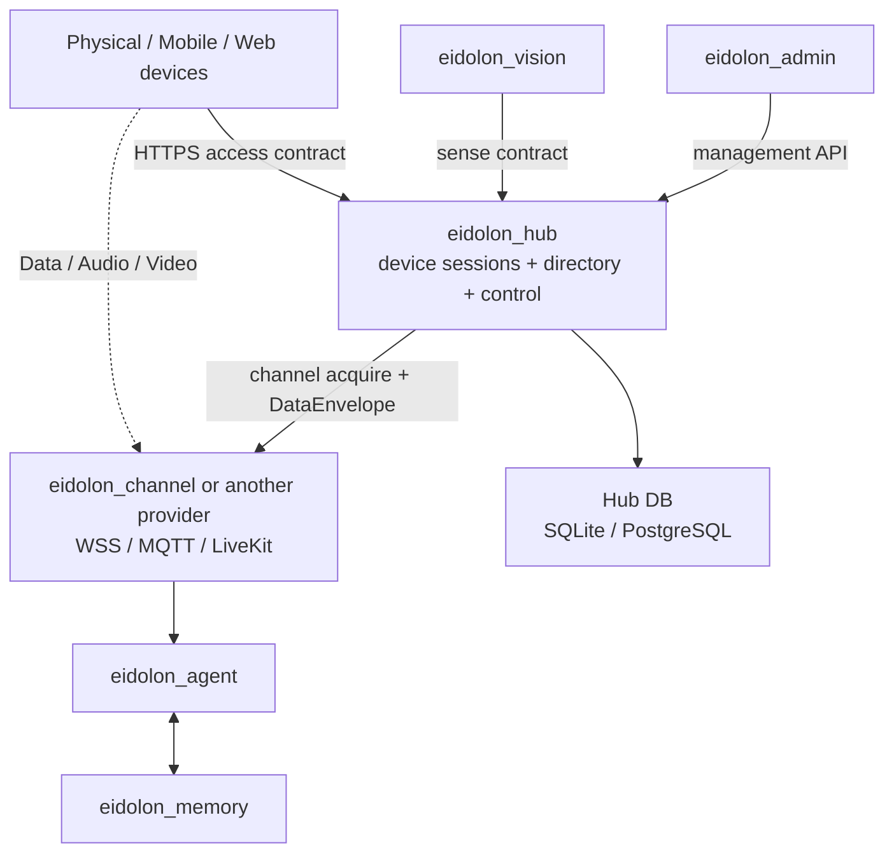

# Eidolon OS 项目边界与 Hub 集成

本页记录 Hub-only 重构后的目标契约。兄弟项目未在本轮修改，不能把 Reference Provider E2E 当作整栈已经兼容的证据。

| 项目 | 与 Hub 的目标关系 |
|---|---|
| `eidolon_channel` | 可实现外部 Channel Provider。接收 Acquire device context，自主选择 WSS/MQTT/LiveKit，独占设备 URL、凭据、TURN、Codec 和媒体资源；转换普通 `DataEnvelope` |
| `eidolon_agent` | 通过 Hub Device Management/API 或 Provider 标准事件使用设备能力，不读取 Hub DB/KV，不要求 Hub 保留 NATS |
| `eidolon_admin` | 使用 management JWT 调用 `/health` 与 `/api/device-management/v1/*`，不复制 Device/Channel 领域逻辑 |
| `eidolon_vision` | 使用 Hub Sense Schema 提交 bounded facts；像素不经过 Hub |
| `eidolon_memory` | 保持 Agent 业务依赖，不进入 Hub 在线或 Channel 边界 |
| `eidolon_data` / `eidolon_sdk` | 不是 Hub 运行时依赖；其他项目现有依赖不由 Hub 隐式共享 |
| Devices | 保存 Commissioned Descriptor URI；用 HTTPS 建立 Session/注册/心跳；获批后主动 Acquire，并把 opaque binding 交给对应 Provider SDK |

Provider 最小接口：

- `POST {contract_url}/device-channels/acquire`：接收 operation、Hub ID 和必要设备上下文，返回通用 Assignment 与 base64 opaque binding。
- `POST {contract_url}/data/envelopes`：接收 Hub outbound Command envelope。
- 回调 Hub `/api/provider/v1/channels/lifecycle` 和 `/api/provider/v1/data/inbound`。

后续 consumer 迁移顺序必须独立推进：先稳定 Hub 单元/契约/Local/Cloud/模式切换/E2E 门禁，再为 `eidolon_channel` 实现 Provider Contract，随后迁移一类设备、Admin、Agent/Vision 和其他终端。旧契约不双写兼容。
