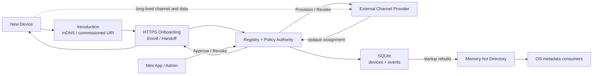
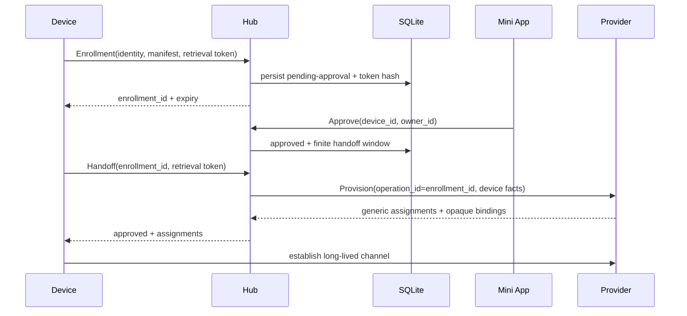

# Eidolon Hub 当前控制面架构

文件名保留了历史命名；当前实现不再是三平面或 Connection Plane。Hub 已收敛为短生命周期的 Device Onboarding 控制面。



## 逻辑边界

| 边界 | Hub 拥有 | Hub 不拥有 |
|---|---|---|
| Introduction | mDNS 发布 HTTPS Descriptor、接受配网保存 URI | 跨 VLAN 转发、WAN transport、网络侧 DNS Proxy |
| Onboarding | Enrollment、Token hash、有界 Handoff | 长期 Session、Heartbeat、Lease、online |
| Registry/Policy | Identity、Manifest、Owner、批准和吊销 | 设备业务状态与 Channel presence |
| Directory | Owner-scoped metadata Get/List、管理事件 | Command、State、Event、A/V |
| Provider Control | typed Provision/Revoke、opaque relay | backend 选择、credential 与 Channel lifecycle |

## Enrollment、Approval 与 Handoff



未批准 Handoff 返回 HTTP 202 和空 Channel 列表；Token 错误返回 403；窗口过期返回 410；Provider 契约错误和不可达分别返回 502/503。Hub 不为 pending/revoked 设备 Provision。

Provider Assignment 只存在于当前调用栈。Provider 按稳定 `enrollment_id` 幂等 Provision，设备可安全重试；Hub 不增加 mailbox、MQTT signaling、持久 Grant 或 lifecycle callback。

吊销先持久化 revoked，再调用 Provider Revoke。Provider 负责使其 credential 和长期连接失效；Hub 不恢复 revoked 状态。

## 数据、存储与进程模型

设备完成 Handoff 后，Command、State、Event、realtime data、Audio 和 Video 永不通过 Hub。Provider 可自行使用 MQTT、WSS、LiveKit 等 backend。

SQLite 是唯一权威源，只有 `hub_devices` 与 `hub_events`。公共 Directory 是内存投影，启动直接扫描 `hub_devices` 重建；没有重复持久化投影。Composition 在打开数据库前获取 `<database>.lock` 非阻塞独占锁，第二个 Hub 进程 fail closed。

Hub 不依赖 NATS、MQTT、LiveKit、`eidolon_channel`、`eidolon_data`、`eidolon_sdk`、PostgreSQL 或 OpenTelemetry。HTTP Provider Control 是低频 Request/Reply；在没有 profiling 证据前不增加 gRPC。

## 分层

```text
domain
ports       -> domain
application -> ports + domain
contracts   -> ports + domain
adapters    -> contracts + ports + domain
interfaces  -> contracts + application + ports + domain
composition -> interfaces + adapters + contracts + application + ports
main        -> composition
```

Composition Root 是唯一具体实现选择位置；Domain/Application 不出现 FastAPI、SQLAlchemy、HTTPX、Zeroconf 或 Provider backend 分支。
