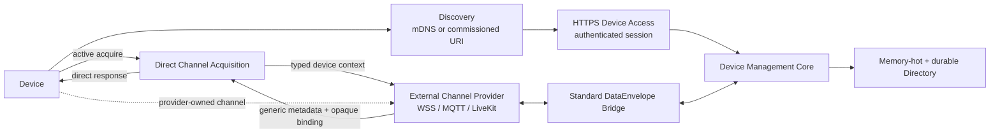

# Eidolon Hub 设备控制面架构

## 定位

Hub 是跨会话设备控制面和契约化 Device Bus。它管理设备事实与可达性，但不实现设备通信后端。Local 与 Cloud 使用相同 Contract、Domain 和 Use Case；仅 Persistence/Discovery 配置不同，且不自动桥接数据。



## 边界与依赖

| 边界 | 拥有 | 不拥有 |
|---|---|---|
| Discovery | mDNS 发布 Hub Descriptor URI | 注册、在线、跨 VLAN 转发、Unicast DNS/SRP 客户端 |
| Device Access | Challenge/Proof、Device Session、注册传输、心跳、authority fencing | MQTT/WSS/LiveKit、命令数据通道 |
| Device Management | Device、Manifest、Owner/审批/吊销、Command Ledger、Directory、事件流 | FastAPI/SQLAlchemy/数据库类型 |
| Channel Contract | Provider-neutral context、Assignment metadata、Lifecycle、安全门禁、opaque relay | Profile、后端选择、URL/Room/Token/TURN/Codec、Provider 资源策略 |
| External Provider | 实际 WSS/MQTT/LiveKit 后端、动态凭据、Audio/Video、协议转换 | 设备注册、Hub 在线判定 |

依赖方向固定为：

```text
domain <- application <- ports <- adapters/interfaces/composition
```

Wire DTO 经显式 Mapper 转为不可变 Domain Value。SQLAlchemy 只出现在 Persistence Adapter/Composition；Router 只获得 Use Case。Hub Core 不导入 FastAPI、Zeroconf、Provider 实现或数据库库。

## 发现与 Device Session

发现只负责取得 `HubDescriptor`：

- 同链路可用 `python-zeroconf` 发布 Descriptor URI，不桥接 VLAN multicast。
- WAN/复杂子网以 Commissioning 保存的固定 HTTPS URI 为基线。
- Unicast DNS-SD、RFC 8766 Discovery Proxy 和 SRP 是设备/网络侧能力。标准 mDNS browse API 不会自动切换到它们；Hub 不重复实现 DNS resolver/proxy。

设备取得 URI 后，经 HTTPS Hello/Challenge/Proof 建立 `DeviceSessionLease`。会话拥有递增 heartbeat sequence、到期时间、Hub instance 和 fencing token。Directory `online` 只由当前最高 fencing generation 的有效 Session 推导，Channel active 不等于在线。Session、Authority、Challenge 和 Directory 都持久化，进程重启不会清空黑板。

## 直接 Channel Acquisition

注册和审批先独立持久化。获批设备用当前 Session 调用：

```text
Device -> Hub: POST /api/device-access/v1/channels/acquire
Hub -> Provider: POST {contract_url}/device-channels/acquire
Provider -> Hub: generic assignments + base64 opaque bindings
Hub -> Device: same assignments + bindings
```

这不是后台 desired-state 编排，也没有 mailbox、Connector signaling、Profile 或 Provider 路由规则。Provider 故障使本次 Acquire 返回 503，但不回滚注册事实。设备可按 request ID 安全重试；Provider 应按 operation ID 幂等。

Hub 只校验 operation/device/manifest、通用 kind/purpose、初始 pending 状态和最小有效期。它只持久化非秘密 Channel Lease metadata；opaque binding 只在调用栈中 base64 编解码并直接返回，不进入 DB、Directory、事件或日志。Provider 回调 `active` 后，该 lease 才可承载数据。

Provider Control 与 Data Transport 是独立 Port。实际 Provider 可选择 WSS、MQTT、LiveKit 或组合实现，Hub 不依据 binding format 分支。普通管理数据使用有方向、Bearer-authenticated 的接口：

```text
Hub -> Provider: POST {contract_url}/data/envelopes
Provider -> Hub: POST /api/provider/v1/data/inbound
Provider -> Hub: POST /api/provider/v1/channels/lifecycle
```

命令和上行 Envelope 必须同时绑定 active Channel Lease 与 active Device Session。数据库 cursor 拒绝重复/乱序；设备只能返回 Ack、Result、ReportedState、DeviceEvent。Audio/Video 永不转换成 `DataEnvelope`。

## 持久化、内存热路径与多实例

数据库是权威源。SQLite 用于 Local，PostgreSQL 用于 Cloud；上层只依赖 Repository Port。公共 Device Directory 可启用进程内热缓存：启动从 DB 恢复，写入先提交 DB 再更新内存，多实例按 revision 周期对账。缓存只优化读取，不参与授权、fencing、session/channel 校验或 command/cursor 正确性。

Hub 不依赖 NATS/JetStream。多实例正确性由 PostgreSQL 行锁、递增 authority fencing、幂等 ID 和持久事件流承担。外部模块通过 Device Management API/事件游标交互，不读取 Hub 内部表或 KV。

## 配置与 Composition

`hub/composition/app.py` 是唯一生产组装位置。`config/settings.yaml` 只有 API、Observability、Discovery、Device Access、Channel Provider 地址和 Persistence；未知字段 fail closed。Hub 不含 MQTT、LiveKit、具体媒体或硬件配置。
