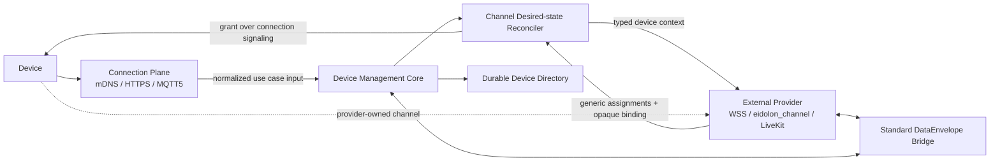
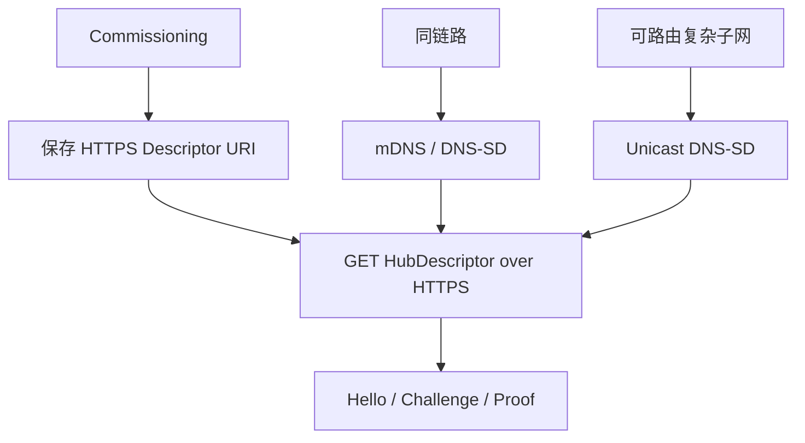

# Eidolon Hub 三平面架构

## 定位

Hub 是跨会话设备控制平面，拥有设备身份、注册事实、可达性、能力目录、命令账本与 Channel 生命周期；它不是媒体服务器，也不拥有设备侧 Channel Provider 的部署细节。



Local 与 Cloud 部署复用同一套 Schema、Repository Port 和状态机，但必须使用不同的 `hub_id`、数据库和凭据。Local 使用独立 SQLite，Cloud 使用 PostgreSQL；Hub 不内建 Local/Cloud 桥接。

## 所有权与边界

| 平面 | 拥有 | 明确不拥有 |
|---|---|---|
| Connection | Hello/Challenge/Proof、注册传输、心跳、连接 Lease、Signaling return path | 命令、状态、事件、音视频、Channel 在线状态 |
| Device Management | Device、Manifest、审批/撤销、Command Ledger、Owner scope、Directory | FastAPI/MQTT/SQLAlchemy/数据库类型 |
| Channel Control | 设备 desired-state sync、数据库 claim、通用 Lease/Lifecycle、Grant 中继 | Profile/路由策略、URL、Room、Token、TURN、Codec、Provider 资源生命周期 |
| External Provider | WSS/LiveKit 端点与凭据、Data/Audio/Video 实际链路 | 设备注册、Hub 在线判定 |

依赖方向固定为：

```text
domain <- application <- ports <- adapters/interfaces/composition
```

Wire DTO 只能在 Contract/Adapter/Interface 中出现，经显式 Mapper 转成不可变 Domain Value。SQLAlchemy 只能由 Persistence Adapter 和 Composition Root 使用；Router 只获得 Use Case。Hub 不依赖 `eidolon_data` 或通用消息总线。

## 发现与复杂子网

发现是取得 `HubDescriptor`，连接是随后执行认证与 Lease 生命周期，两者不能混为“在线”。



- mDNS 遵循 RFC 6762，只用于同一链路；Hub 使用 `python-zeroconf` 在所有可用 IPv4/IPv6 接口发布服务并响应接口变化，但不转发或泛洪 VLAN multicast。
- 每种设备在 Commissioning 时都必须能保存显式 HTTPS Descriptor URI；这是跨网段最小、最可预测的基线，不依赖设备硬件类型。
- Unicast DNS-SD Adapter 使用 `dnspython` 查询 PTR/SRV/TXT/A/AAAA。设备必须发起普通单播 DNS 查询；只调用标准 mDNS browse API 的设备不会自动切换到该路径。
- RFC 8766 Discovery Proxy 与 RFC 9665 SRP 是网络基础设施能力。标准 mDNS SDK 不会无感知地获得 Discovery Proxy 能力，Hub 也不重新实现 Proxy/SRP。网络可部署这些能力，但设备仍需相应的 Unicast DNS-SD/SRP 客户端或 Commissioned URI。
- 不对资源受限设备作 ESP32 假设。最低设备契约仅要求持久化 URI、HTTPS/MQTT5 中至少一种连接 Binding，以及对统一 JSON Schema 的实现。

实现位置：`hub/adapters/discovery/zeroconf.py`、`unicast_dns.py`、`explicit_uri.py`。

## Connection Lease 与多 Connector

一个设备可同时拥有 HTTPS 与 MQTT5 等多个 `ConnectionLease`。Directory 的 `online` 是“至少一个未过期且未关闭 Lease”，与实际通信 Channel session 无关。连接按 priority、fencing token、connection ID 选择 signaling return path。关闭路径只修改 Hub 拥有的 Connection 事实；后台 Reconciler 观察到最后路径关闭后，再把 `connected=false` 同步给 Provider。

`DeviceAuthorityLease` 以 `(device_id, hub_instance_id, fencing_token)` 进行 CAS：

1. Hub instance 获取或续约 authority。
2. 新 owner 获取严格递增 token。
3. 旧 Hub 的 token 不能续租或覆盖新状态。
4. 相同 request ID 和 heartbeat sequence 必须幂等；内容冲突必须拒绝。

Challenge、Connection、Authority、Directory、Channel Lease 和 DataEnvelope cursor 都存入 Hub 自有数据库，因此 Hub 进程重启不等于清空公共黑板。

## MQTT5 限制

MQTT Topic 固定为：

```text
eidolon/v1/devices/{device_id}/connection/in
eidolon/v1/devices/{device_id}/connection/out
```

Inbound Codec 只接受 Hello、Proof、Registration、Heartbeat 和 Disconnect；Topic device ID 必须与 Payload 身份一致，设备只能发送 `reason=client` 的关闭消息。Outbound 除 Connection 响应外只允许 Provider 产生的 Channel Grant。设备侧 Channel Offer/Accept/Close、Command、State、Event、Data、Audio、Video 在 Schema/operation 层直接拒绝。生产 Broker 还必须配置同样的 publish/subscribe ACL，不能只依赖 Hub 的运行时校验。

## Provider 无关的 Channel

Hub 配置只有一个版本化 `channel_provider.contract_url`。没有 Profile、Provisioner map 或 Provider 路由规则。设备注册、Manifest、审批、撤销和 Connection 都先成为数据库权威事实；后台 Reconciler 计算包含设备元数据和可达性的 content revision，通过有期限的 SQL claim 竞争同步任务，并调用：

```text
Hub -> Provider: POST {contract_url}/device-channels/sync
Hub -> Provider: POST {contract_url}/data/envelopes
Provider -> Hub: POST /api/provider/v1/channels/lifecycle
Provider -> Hub: POST /api/provider/v1/data/inbound
```

Provider 根据 typed device context（identity fingerprint、tenant/owner、Manifest、approval/revocation、connected）独立决定实际通道，返回通用 assignment：channel/device、purpose、kinds、binding format、issued/expires，以及最大 64 KiB 的 `OpaqueChannelBinding`。Owner transfer 会改变 desired revision 并触发同步；Hub 只透传这一安全事实，不据此选择具体 Provider 技术。活跃可达设备至少需要一个 `purpose=management`、`kind=reliable-data` 的 Assignment，才能满足 Device Bus 的命令契约。

Hub 只做 base64 Wire 编解码，不检查 Binding 语义、不写入 Directory/DB、不返回给管理客户端、不记录日志。Grant 先以 `pending` lease 落库并经当前 HTTPS mailbox 或 MQTT Connector 中继；Provider 回调 `active` 后才允许 DataEnvelope。仍有足够有效期的 pending Grant 在投递窗口后使用同一个幂等 operation 重发，因此 Hub 重启不会永久丢失只存在内存 mailbox 中的 Binding。

设备事实的 desired revision 与 Assignment issuance generation 分离：失败重试和 pending 补投复用 operation；终态或进入 30 秒刷新窗口的 lease 使用由当前通用 lease metadata 确定的新 operation。Hub 只决定“必须有可用的可靠管理通道”及 lease 安全门禁，不决定 WSS/LiveKit、Codec、Room 或 Provider 内部的续期方式。Provider 返回的 Grant 必须覆盖刷新窗口，过期或有效期不足的响应会被拒绝。

Provider 故障不在注册关键路径中。失败类型和 attempt 写入 Hub DB，指数退避后重试；多 Hub instance 只能在 claim 过期后接管。断连、撤销和 Manifest 更新都由同一个 desired-state sync 收敛，不由 Hub 调用 Provider-specific renew/revoke API。

设备侧普通管理数据和实时 Provider 都映射为统一 `DataEnvelope`。Provider Bridge 使用两个有方向的认证 HTTP 接口：

```text
Provider -> Hub: POST /api/provider/v1/data/inbound
Hub -> Provider: POST {contract_url}/data/envelopes
```

WSS/LiveKit Gateway 属于外部 Provider：它接收 outbound Command Envelope，将设备 Ack/Result/ReportedState/Event 写回 inbound。Hub 用数据库 cursor 拒绝重复和乱序，并再次校验 Channel Lease 与 device ID。Audio/Video 永不进入 `DataEnvelope` 或 Hub Core。

## Hub 自有持久化与内存热路径

数据库是强状态的唯一权威源。`ManagedDevice`、Command Ledger、Challenge、Connection/Authority Lease、Channel Lease/Cursor、Directory 和事件日志均先提交数据库；上层只依赖 Repository Port，通过 `persistence.adapter` 在 SQLite 与 PostgreSQL 之间切换。

公共 Device Directory 使用可选的进程内热投影：启动时从数据库完整恢复，写入时先提交数据库再更新内存，Cloud 多实例按 revision 周期性替换对账。独立的 Projection Worker 周期性从 Device 与有效 Connection Lease 权威事实重算 Directory，使自然过期且没有 Disconnect 的设备也会变为离线；无语义变化时不修改 revision/updated time。数据库失败时不得先修改内存。审批、吊销、认证、fencing 和 cursor 等影响正确性的读取不走软缓存。

移除 NATS 后，多实例正确性由 PostgreSQL 行锁/CAS、递增 fencing token 和持久事件日志承担。事件在写入时固化 owner scope，外部模块通过 `/api/device-management/v1/events/{owner_scope}` 以 stream position 增量读取，而不是读取内部 KV/表；设备转移 owner 不会把旧 owner 的历史事件一并泄露。进程内缓存只降低读延迟，不承担跨节点一致性；对账延迟只影响 Directory 展示新鲜度，不得影响授权与命令状态。

## Device Directory 与授权

Directory 是 Owner scoped、durable、增量 CAS projection，公开：

- Device identity、display name、kind；
- WoT 风格 Manifest JSON 与 content-addressed revision；
- approved/revoked/online；
- 非敏感 Connector 类型和 Lease 到期时间。

它禁止 signaling ref、lease token、opaque binding、Provider endpoint 和媒体凭据。管理 API 使用有 audience、expiry、role、owner scope 的 JWT；普通 `device-manager` 只能访问自己已审批且未撤销的设备，`hub-admin` 执行 Commissioning 审批。

## 可观测性与秘密处理

HTTP middleware 只记录 method、route template、status、latency。OTLP endpoint 为空时不启动 exporter；启用后使用 batch span/log processors 与 periodic metric reader。Request body、URI query、MQTT payload、Room/TURN/Token 和 opaque binding 不进入 telemetry attribute 或日志。

## Composition Root

`hub/composition/app.py` 是唯一生产组装位置。它在打开数据库和 Connector 前校验配置与 secrets，根据配置创建 SQLite/PostgreSQL Adapter，并以 `AsyncExitStack` 按逆序关闭 telemetry、内存投影、HTTP client、数据库和 Connector。旧 register/token、LiveKit 在线判定、snapshot blackboard、NATS 与 `eidolon_data` Adapter 不再存在于 Hub 源码或 artifact。

配置只有两个源：受版本控制且不含秘密的 `config/settings.yaml`，以及本地忽略的 `config/.env`。`connection_plane.mdns` 是该平面的 discovery publisher 配置，`connection_plane.mqtt` 是 Connection Connector 配置。YAML 未知字段 fail closed；Channel 配置只有 Provider contract URL，Hub 没有具体传输或媒体 Setting。
